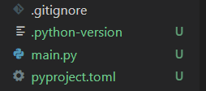

# study-uv
仮想環境を作る uv の学習

## uv 設定手順
### 1. uv のインストール  
[uv公式インストールページ](https://docs.astral.sh/uv/getting-started/installation/)のとおりインストール

```
# for WSL(Ubuntu) 
curl -LsSf https://astral.sh/uv/install.sh | sh
uv --version
```

### 2. プロジェクト作成
```
# プロジェクト作成
# すでにプロジェクトのフォルダがある場合は `uv init`
uv init sample-project
```
以下のファイルが作られる  



### 3. 仮想環境作成
```
uv venv
```
`.venv` フォルダが作られ、uv を使ってインストールした依存関係はこのフォルダ内に保存される。  
仮想環境を使うにはこの `.venv` があるフォルダで uv コマンドを使う  

※ python のバーションを変える場合は `uv python pin 3.x` を実行した後に venv を作成（python のバージョンがない場合は自動でインストールされる）

### 4. ライブラリの追加
```
uv add requests
(uv pip install requests と同じだが、uv.lock や pyproject.toml が更新されないので、非推奨)
uv pip list
```
`uv.lock` が作成される  
`uv add "requests==x.x.x"` でバージョン指定  
`uv sync --update` で pyproject.toml の範囲内でバージョンのアップグレード  
`uv remove requests` でライブラリの削除

### 5. 仮想環境下での python 実行
```
# 仮想環境を使ったシェルコマンドの実行
uv run python main.py
```

### 6. 仮想環境の再現
pyproject.toml, uv.lock, .python-version をコピーしたフォルダで以下を実行  
```
uv sync
```


## 参考サイト
- [uv公式インストールページ](https://docs.astral.sh/uv/getting-started/installation/)
- [サプーの動画](https://www.youtube.com/watch?v=VgH1GKSCXJQ)
